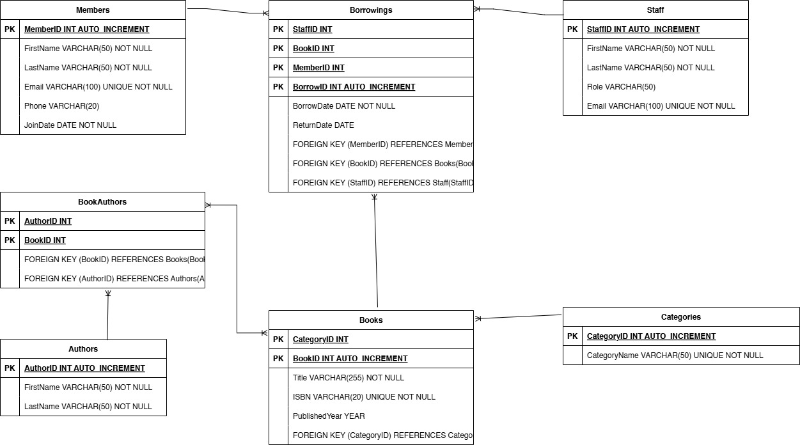

# 📚 Library Management System (MySQL Database)

## 🎯 Objective
This project implements a relational **Library Management System** using **MySQL**. The system handles data for books, members, authors, categories, staff, and borrowings.

---

## 🗃️ Schema Overview (ERD)

- **Members**: Registered library users.
- **Staff**: Employees who manage book loans.
- **Books**: The library's collection.
- **Authors**: Linked to books (many-to-many).
- **Categories**: Book genres or types.
- **Borrowings**: Records of book loans.

---

## 📑 Database Design

### ✅ Tables Created

1. `Members(MemberID, FirstName, LastName, Email, Phone, JoinDate)`
2. `Staff(StaffID, FirstName, LastName, Role, Email)`
3. `Categories(CategoryID, CategoryName)`
4. `Authors(AuthorID, FirstName, LastName)`
5. `Books(BookID, Title, ISBN, PublishedYear, CategoryID)`
6. `BookAuthors(BookID, AuthorID)` – _junction table_
7. `Borrowings(BorrowID, MemberID, BookID, BorrowDate, ReturnDate, StaffID)`

---

## 🧱 Relationships

- **1-to-Many**
  - One Member → Many Borrowings
  - One Book → Many Borrowings
  - One Category → Many Books
  - One Staff → Many Borrowings

- **Many-to-Many**
  - Books ↔ Authors via `BookAuthors`

<br>
<br>

### ERD



<br>

---

## 📂 How to Use

1. Open MySQL Workbench or CLI.
2. Run the provided `.sql` script to create the database and tables:

```sql

    SOURCE path_to_file/library_management.sql;

```


### 📊 Sample Queries

```sql    
    -- List all books with authors
    SELECT b.title, Contact(a.FirstName, ' ', a.LastName) AS Author
    FROM Books b
    JOIN BookAuthors ba ON b.BookID = ba.BookID
    JOIN Authors a ON ba.AuthorID = a.AuthorID;

    -- Borrow history of a member
    SELECT m.FirstName, m.LastName, b.Title, br.BorrowDate, br.ReturnDate
    FROM Borrowings br
    JOIN Members m ON br.MemberID = m.MemberID
    JOIN Books b ON br.BookID = b.BookID;
```

<br>
<br>

---

<br>
<br>
<br>
<br>

# 📌 Author

Kholofelo J Mocheko